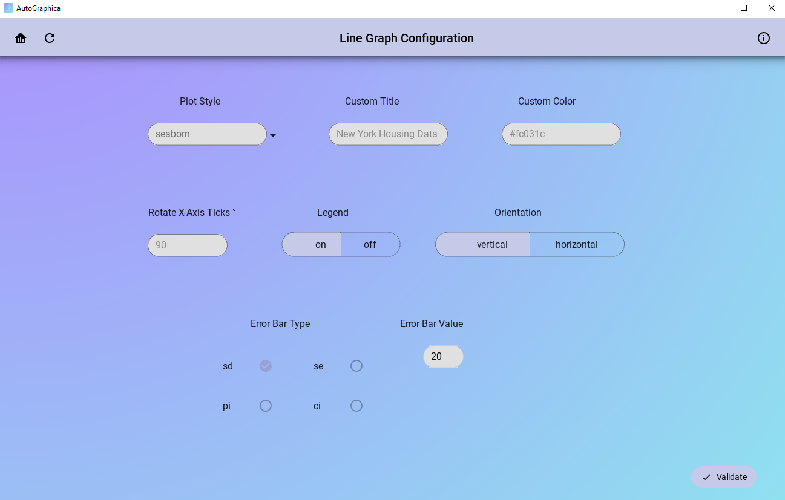
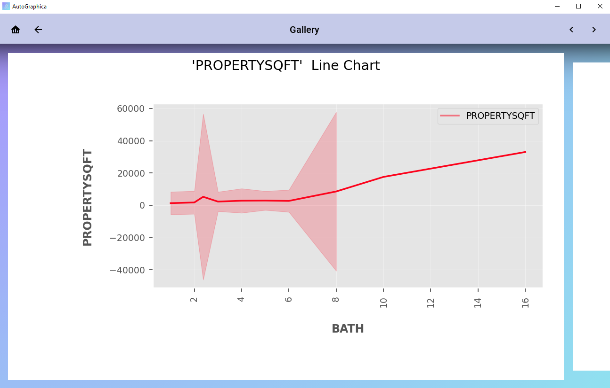
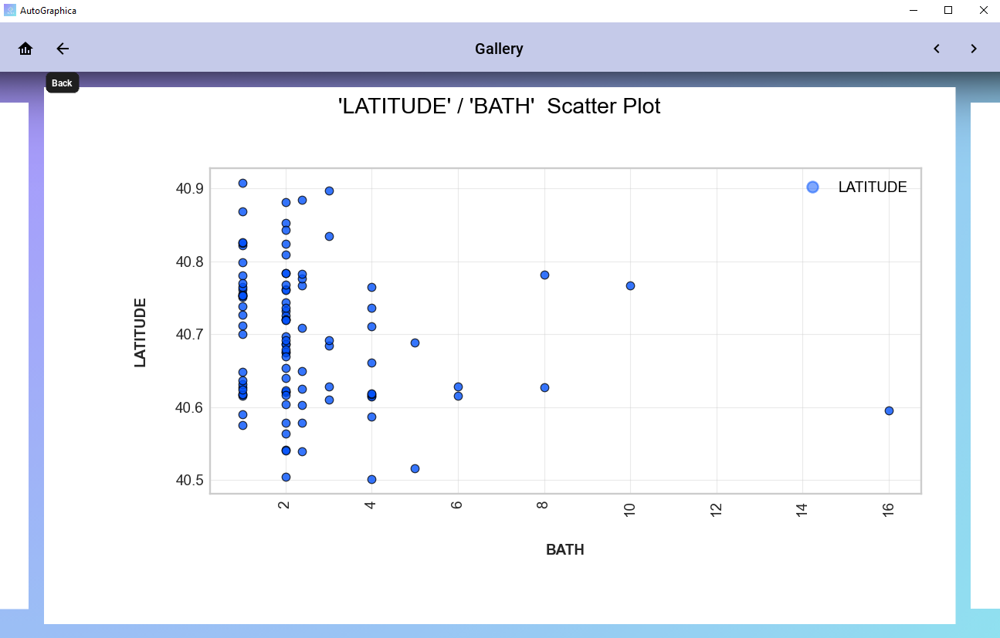
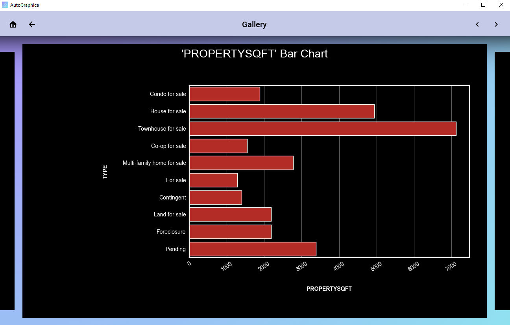
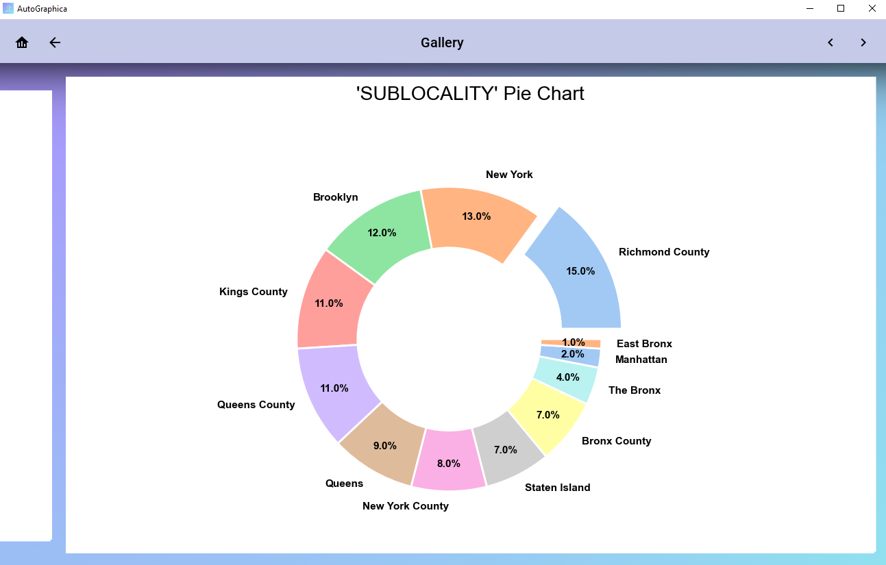

# AutoGraphica

### AutoGraphica is a Data Visualisation app that automates the process of transforming your data in it's raw format into complex and comprehensive data visualisations, that allows you to explore your datasets in clearer and sharper detail.

### With this app, you can take away the pain and stress of having to configure each of the individual elements that go into displaying your dataset. The following options are available to help you display your data faster and explore it more easily than through a typical tabular format.
* Line Graphs
* Scatter Plots
* Bar Charts
* Box Plots
* Histograms
* Multi-Line Graphs
* Multi-Scatter Plots
* Multi-Bar Charts
* Facet Plots

